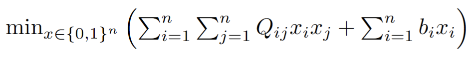
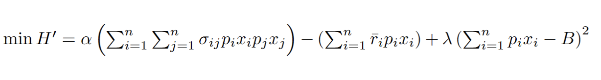

# Quantum Portfolio Optimization 

## Introduction

This project compares the performance of D-Wave hybrid quantum annealing solvers to state of the art classical optimization programs by tasking both approaches with the optimization of financial portfolios.  In the era of NISQ computing, quantum annealing may be the best quantum computing option for portfolio optimization.  Gate based approaches employing QAOA and VQE are other possibilities, but the present hardware limitations of gate based systems present challenges to their use.1  The portfolio optimization model for this project conforms to the foundational and widely used standard: modern portfolio theory, in that its objective function maximizes returns and minimizes risk.  However, a third order constraint that limits the negative skew of the portfolio is added.  Skew is a third order moment which makes the problem a non convex, Mixed Integer Nonlinear Problem (MINLP).

## Theory

### Modern Portfolio Theory  

The portfolio optimization model for this project is the Markowitz mean-variance model, otherwise known as Modern Portfolio Theory or Markowitz Portfolio Theory(MPT).    In 1952, Harry Markowitz published the mathematics of MPT, an optimization approach based on the diversification of assets within a portfolio.2  Markowitz received the Nobel Prize in Economic Sciences for this foundational contribution to the field of wealth management.3  Key to MPT is the idea that the covariance of securities -  the extent to which securities track each other’s movements over time -  can be used to mitigate risk.4 
The model considers only the mean returns and variances of assets in its formulation.  Research into including additional parameters, such as skew (sometimes described as the difference between the median and the mean of the return distribution)  has not shown that additional complexity yields better returns.4   In the interest of investigating performance, the impacts of modifying the model by adding skew as a constraint are explored in this project.

### Problem Definition and Complexity

#### Portfolio Optimization Objective Function

Quantum annealers are designed to solve combinatorial optimization problems like portfolio optimization.  They are physical implementations of Ising models, which mathematically express how elements of a complex system respond to the couplings that exist between them and the external forces that are exerted on them. 
The objective function configures the energy state of the annealer so that it represents the parameters of the problem.  The annealer naturally minimizes its energy state to yield a combination of output values that correspond to an optimal solution.  Solutions are obtained by sampling low energy states at the end of the annealing process.  

Portfolio optimization is mathematically modeled as a Quadratic Unconstrained Binary Optimization (QUBO) problem -  converting QUBO equations to Ising form requires only a simple linear transformation.

 

 Eq. 1 Quadratic Unconstrained Binary Optimization (QUBO) problem

 

Eq. 1 shows an example QUBO minimization equation.  A solver would choose values for binary variables in the vector x such that the sum of all the terms is minimized.  The first term in the QUBO problem incorporates the strengths of the couplings between elements into the equation.  For example, if  Qij is highly negative, the system is incentivized to set  both xi and xj to 1.  The second term represents the cost or penalty for setting xi to 1.  If bi is high, the system is incentivized not to include xi.

 

Eq. 2 Portfolio optimization QUBO

 

Eq. 2 shows an example  of a portfolio optimization QUBO.
The variables are:
<table>
           <tr><td>$\alpha$ = risk aversion coefficient</td></tr>
           <tr><td>n = total number of stocks </td></tr>
           <tr><td>$r_i$ = average monthly percent return for stock i</td></tr>
           <tr><td>$\sigma$ = covariance of returns of stocks i and j </td></tr>
           <tr><td>$p_i$ = price of stock i</td></tr>
           <tr><td>$x_i$ = number of shares of stock i</td></tr>
           <tr><td>$\lambda$ = penalty term coefficient</td></tr>
           <tr><td>B = the budget - term is squared to force the solver to favor valid solutions</td></tr>
</table>
This equation requires the solver to find not only which assets in x should be included in the portfolio, but also how many shares of those assets are best.  To produce integer results for numbers of shares,  a binary expansion method must be used:

<img src = images/EQ3.png"
Eq. 3 Binary Expansion of Integer

A typical portfolio optimization problem is quadratic due to the covariance term of the objective function and has only linear constraints, no cardinality and continuous variables.  

           Covariance term of objective function

A large-scale problem of this type is reliably and efficiently solvable on a classical computer. 5
Three challenging constraints are added to make the problem a more challenging Mixed Integer NonLinear Problem (MINLP) type and increase optimization complexity.   

Constraints

Constraint 1: Cardinality
Limiting the number of assets in a portfolio reduces transaction costs, tax reporting complexity, and management effort.  However, allowing only a certain number of stocks in the portfolio out of the universe under consideration imposes a cardinality constraint on the problem, which has been shown to make it NP-complete - as the number of assets increases, the number of possible combinations for the portfolio grows exponentially. 6

Constraint 2: Skew
The skew of a distribution is the amount to which it has a positive or negative tail.  More technically, it is a distribution's third standardized moment:

Eq. 4  Skew Equation for a distribution, E: expected value,  X: variable  : mean, : std dev, 

A positive skew manifests as a significant tail on the right side, and a negative skew as a tail on the left.  In the case of assets such as stocks, investors consider a returns distribution with a positive skew desirable, as it indicates a tendency toward a greater number of days with nominal or even dramatic positive returns.  

Considering coskew, a measure of how stocks skew together - similar to covariance being a measure of how the variance of a stock aligns with the variance of another stock - introduces a third order term to the portfolio optimization problem.  The skew of a portfolio is arrived at by summing all possible combinations of three stocks (out of those that are chosen for the portfolio)  multiplied by a coskew factor that quantifies how much the three stocks skew together.  

Highly performing individual stocks often have positively skewed return distributions but the same can not always be said for strong portfolios or markets.  This is because economic downturns or panics can spark extreme negative swings in aggregate returns, creating a negative tail, while positive movements on average are more restrained.

The N x N x N coskewness tensor is calculated using the formula:

Eq. 5  Coskew Equation, E: expected value,  X,Y,Z: variables  : mean, : std dev, 

Constraint 3: Maximum number of shares
Constraining the maximum number of shares per stock puts a hard limit on the amount that can be invested in a single stock.

Ocean SDK and D-Wave Models

The D-Wave Ocean software development kit is an open source Python based tool set for developing quantum annealing optimization applications.  It is compatible with Python versions 3.10 or higher and can be installed on Linux, Windows, and Mac systems.  It is cloud accessible on GitHub or any environment that implements development containers.  Up to 2,000,000 variables and constraints are supported.

The SDK offers four main mathematical model types with which the QUBO may be implemented. The four model  types and their use cases are shown in Table 1.  The Constrained Quadratic (CQM)  and Non-Linear(NLM) models natively support the encoding of constraints, rather than requiring them to be added to the objective function as penalty terms, as is the case with the BQM and DQ types. 7  CQM does not support third order terms, NLM does.
 
Model
Use Cases
Binary Quadratic (BQM)
Binary decision problems
Constrained Quadratic (CQM)
Real world optimization
Discrete Quadratic (DQ)
Problems with integer variables or categories (map coloring)
Non-Linear (NLM)
Mixed integer nonlinear optimization and complex math

Table 1

 Hybrid solvers utilize both quantum and classical hardware. The parts of the problem that are best solved classically are handled by CPUs or GPUs, leaving the rest for the annealer’s Quantum Processing Unit(QPU).8   

Method

Stock Universe and Historical Data
A list of equities was compiled using Yahoo Finance screeners.  I diversified asset types by including Exchange Traded Funds (ETFs) that are limited to different types of bonds (government and corporate included) and EFTs that track the commodity prices of gold and silver.  From the over 10,000 equities with available data on Yahoo Finance, I filtered for bond ETFs, two ETFs that tracked the metals gold and silver, and all stocks listed on the  Dow, S & P, and  Russell 2000 indexes.  Unfortunately, I was constrained by the size of the RAM of the virtual machine I was using on my Github codespace (16 GB).  The coskew tensor grows exponentially O(n^3) with the number of equities and is a NumPy array that I believe must exist in a contiguous memory block.  I didn’t have enough time to find a work around, but I did try exhaustively to find out why Github would not give me the option for a higher performance machine with at least 32GB RAM.  I upgraded to Enterprise level and still was not offered a better machine option.  I therefore filtered the stocks based on several parameters to exclude higher risk companies.  Historical daily closing price data for the filtered set of equities over the three year period from 1/1/2021 to 12/31/2023 were downloaded using the YFinance python library.  The mean returns, covariance matrix, and coskewness tensor were calculated for all stocks using Python libraries including NumPy and Pandas.
Filters
Price (Intraday)
 > $10
Index
Dow, S&P, Russel 2000
Employees (FY)
> 200
Market Cap (Intraday)
> $1B
Avg Vol (3 month)
> 500K
Cash on Hand
> $20M
Debt/Equity (D/E) %
Short % of Shares Outstanding
< 200%
Short % of Shares Outstanding 
< 15%
% of Shares Outstanding Held by Insider
< 30%

Objective Function and Constraints
A QUBO was formulated to serve as the objective function of the optimization problem.  Both the classical BARON model and the D-Wave NL model implemented this same objective function:
The problem involves  two sets of decision variables, “shares” and “stocks”.  In the above equation, the  integer variable “shares” holds the number of shares to be bought for each stock under consideration.  A binary variable, labeled  “stocks” in the constraints holds a 1 if the stock is chosen for the portfolio and a 0 if it is not.
Both models imposed the following constraints:
Do not allocate shares if stock was not chosen and do not allocate more than 100 shares to any stock:
   sharesi <= 100* stocksi
If a stock is selected, buy at least one share:        sharesi  >= stocksi 
Use at least 90% of the allocated budget.          insharesi*pricei >= budget*0.90    
Do not exceed the specified budget:                  in sharesi * pricei <=budget
Choose exactly 20 stocks for the portfolio:         in stocksi = 20
The skew of the portfolio should be greater than a minimum target skew of -0.15.
       

Classical Solvers
State of the art classical MINLP solvers use branch and bound algorithms to find optimal solutions.  Branch and bound outperforms brute force search by pruning branches of the search space that are determined to be unable to produce an optimal result.  Meta heuristics like simulated annealing and genetic algorithms, are used in tandem with branch and bound to further improve efficiency.9
I did not perform an exhaustive search for the best classical model to use for comparison.  The BARON solver handles MINLPs, outperforms or matches the performance of other comparable solvers against benchmarks and is widely regarded as state of the art.10  CPLEX and IPOPT solvers were also tested with problems that did not include skew.  I used CPLEX to test out my problem before submitting it to NEOS or to the D-Wave hybrid solvers so that I didn’t waste my allocated hybrid solver time.  
For the BARON model,  the objective function and constraints were encoded in AMPL and submitted to the UW-Madison NEOS server.   The BARON and D-Wave NLM implementations share all the same constraints and have equivalent objective functions.
D-Wave Implementation
Two D-Wave model types were implemented:  CQM and NLM.  The CQM does not support third order terms so the skew constraint was not included in its implementation.  Models were run on D-Wave’s hybrid solvers. D-Wave had me attend a Zoom meeting with a salesman and technical advisor before approving me for the 3 month launch program.  The Leap dashboard indicates that I have an hour of solver time.  I don’t know if that is an hour of time for the month or an hour of time for the entire trial period.  
Code
The Data_Collection_CPLEX_AMPL.ipynb file contains Python functions for a number of purposes:
Downloading YFinance data: get_stocks_from_screener()
Calculating mean, covariance, and coskew: get_stock_info()
Running the CPLEX solver: run_CPLEX()
Backtesting solutions (calculating return, risk, and Sharpe ratio for a portfolio): backtest(), risk()
Generating AMPL .dat file to submit to the NEOS servers: generate_ampl_dat()
Portfolio_BARON.mod is the AMPL model that was submitted to BARON.  Portfolio_BARON.dat is the AMPL data file that was generated with the Python function generate_ampl_dat() found in Data_Collection_CPLEX_AMPL.ipynb.
The GitHub codespace is derived from  a D-Wave template codespace.  The template provides a preconfigured development environment with all Ocean libraries already installed.  The CQM model generating function, build_cqm() is found in CQM_Model.py.  The function portfolio_opt() found in NonLinear_Model.py builds the NL model. 
Here is the GitHub repository containing my D-Wave code for this project.  All data collecting and gathering code can be found in Data_Collection_CPLEX_AMPL.ipynb.  
Files included in uploaded folder
BARON_results_DOW30.txt - Direct output from BARON for DOW 30 problem
Bond ETFs.csv - Yahoo screener file for bond etfs
Commands.run - Command file used when submitting BARON model to NEOS
Data_Collection_CPLEX_AMPL.ipynb - Data collection and processing, CPLEX code
portfolio_BARON.dat - BARON data submitted to NEOS for 80 stock problem
portfolio_BARON.mod - BARON model submitted to NEOS
Real_Estate.csv - Yahoo screener file for real estate etfs
The Dow The Dow The Dow Right Now.csv - Yahoo screener file for the DOW 30
GitHub repository:  https://github.com/Midway-Road/Portfolio-Optimization-
Backtesting
Portfolios produced by the classical and D-Wave solvers were backtested over a time period from 1/1/24 to 4/14/2026.  The return, risk, and sharp ratio were computed for the backtested portfolios.
Results
Universe: DOW 30
Budget:$10,000, Coskew limit: -0.15, maximum shares per stock: 100
Overall Performance
Solver
Number of Stocks
Number of Variables
Number of Constraints
Execution Time
QPU Access Time*
BARON
30
60
64
4 m : 43 s
n/a
D-Wave hybrid NL
30
60
64
1 m :02 s 
1.5 s

Solver
Number of Stocks Chosen (Constrained to exactly 20)
Amount of $10,000 Budget Spent
Portfolio Return %
Portfolio Risk %
Sharp Ratio
BARON
14
$8,672.83 
43.56
26.02
1.52
D-Wave hybrid NL
20
$9,923.40 
79.74
24.04
3.15

*QPU Access Time:  the time to execute a single quantum machine instruction on a QPU.  Quantum anneal times are shown in green. There are multiple sampling cycles and so multiple annealing times.
.
Source: D-Wave, Operation and Timing 

Portfolios DOW 30
Stock
Number of Shares
Price per share on 1/01/2024
Cost
D-Wave
NLH
Cost BARON
Price per share on 4/02/2026
Return D-Wave
Return BARON
D-Wave NLH
BARON
AAPL
2
0
$183.73
$381.10
$0.00
$255.92
$144.38
$0.00
AMGN
3
1
$277.64
$806.69
$268.90
$347.94
$210.89
$70.30
AMZN
2
0
$149.93
$303.88
$0.00
$209.77
$119.68
$0.00
AXP
4
1
$183.11
$728.67
$182.17
$300.18
$468.27
$117.07
BA
0
0
$251.76
$0.00
$0.00
$208.22
$0.00
$0.00
CAT
1
1
$283.14
$286.00
$286.00
$717.22
$434.08
$434.08
CRM
1
0
$252.42
$259.33
$0.00
$186.71
-$65.71
$0.00
CSCO
12
1
$47.18
$566.25
$47.19
$79.02
$382.10
$31.84
CVX
0
9
$135.63
$0.00
$1,218.06
$198.97
$0.00
$570.06
DIS
1
0
$88.91
$88.50
$0.00
$96.61
$7.70
$0.00
GS
0
0
$369.59
$0.00
$0.00
$863.04
$0.00
$0.00
HD
1
0
$326.45
$327.84
$0.00
$321.63
-$4.82
$0.00
HON
1
0
$187.81
$188.45
$0.00
$229.45
$41.64
$0.00
IBM
3
5
$151.08
$458.99
$764.98
$248.16
$291.25
$485.41
JNJ
0
1
$149.66
$0.00
$146.64
$243.04
$0.00
$93.38
JPM
10
1
$163.01
$1,611.34
$161.13
$293.10
$1,300.91
$130.09
KO
9
1
$56.00
$496.49
$55.17
$76.72
$186.49
$20.72
MCD
0
5
$281.83
$0.00
$1,406.62
$307.14
$0.00
$126.56
MMM
1
1
$86.86
$86.32
$86.32
$144.47
$57.61
$57.61
MRK
0
20
$105.46
$0.00
$2,030.53
$120.87
$0.00
$308.27
MSFT
2
1
$364.59
$739.34
$369.67
$373.46
$17.74
$8.87
NKE
0
0
$101.67
$0.00
$0.00
$44.19
$0.00
$0.00
NVDA
35
15
$48.14
$1,732.21
$742.38
$177.39
$4,523.80
$1,938.77
PG
2
1
$140.39
$276.64
$138.32
$143.12
$5.45
$2.73
SHW
0
0
$299.04
$0.00
$0.00
$318.00
$0.00
$0.00
TRV
0
1
$184.31
$0.00
$183.42
$293.99
$0.00
$109.68
UNH
1
1
$514.26
$501.99
$501.99
$277.26
-$237.00
-$237.00
V
0
0
$254.57
$0.00
$0.00
$300.80
$0.00
$0.00
VZ
1
1
$33.02
$32.02
$32.02
$48.67
$15.64
$15.64
WMT
1
1
$51.86
$51.33
$51.33
$125.79
$73.93
$73.93
Totals:
93
68

$9,923.38
$8,672.84

$7,974.03
$4,358.01

Universe: 80 equities
60 Bond ETFs, Gold ETF, Silver ETF, Dow 30, 30 dividend paying real estate stocks (model does not account for dividends)
Budget:$1,000,000, Coskew limit: -0.15, maximum shares per stock: 10000
dwave.cloud.exceptions.SolverFailureError: The size of the states must not exceed 786432000. 
With this problem I got an error from dwave.  I tried reimplementing the NL model in a more memory efficient way but got poor results as can be seen in the chart below.  I have not been able to resolve this poor performance.  This model performed similarly to the first NL implementation on the DOW 30 problem  .  
Overall Performance
Solver
Number of Stocks
Number of Variables
Number of Constraints
Execution Time
QPU Access Time*
BARON
80
160
164
3 m 30 s .
n/a
D-Wave hybrid NL
80
160
164
1 m 0.34 s
1.738 s 

Solver
Number of Stocks Chosen (Constrained to exactly 20)
Amount of $10,000 Budget Spent
Portfolio Return %
Portfolio Risk %
Sharp Ratio
BARON
20
$1,001,829.99 
48.87%
15.04
2.98
D-Wave hybrid NL
20
$900,005.03 
12.41%
16.87%
0.5

